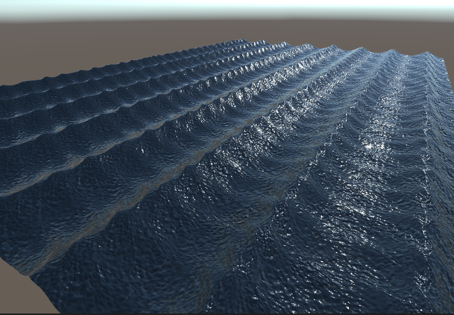

# CGP-Mini-project

The miniproject presents an ocean shader, with a number of distortions which can be applied to the mesh of a plane.

The shader contains a number of properties which can be changed manually or by code.

- _Color    //Color of the Ocean
- _MainTex  //Main texture (albedo)
- _FlowMap  //Flow Map
- _DerivHeightMap //Height Map
- _UJump  //Offsetting the UV to make the animation to change over time.
- _VJump
- _Tiling //Tiling the distorted texture
- _Speed  //Animation speed for the distorted texture
- _FlowStrength //Strength of the flow, which is determined by the flow map
- _FlowOffset //Offset of the flow animation
- _HeightScale  //Scale the height of the small waves
- _HeightScaleModulated //Height scaled based on flow strenght
- _WaveA  	//Vectors for the big waves, which controls the direction,
- _WaveB    //steepness and wavelenght. Can add as many waves as you want.
- _WaveC

## Running the code

1. Clone the repository.
2. Open with Unity (made with unity version 2020.3.32f1)

Then to change the ocean:
1. Go to the materials folder.
2. Find "Wave" material.
3. Change the parameters.
